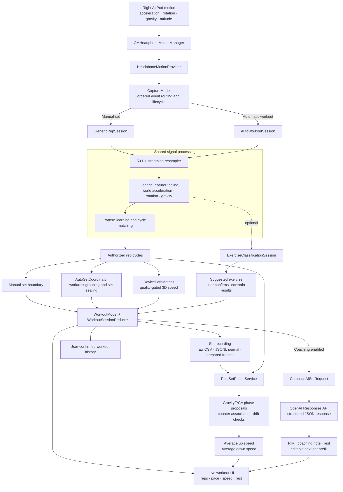

# LiftPod

LiftPod is a native iPhone workout tracker that uses motion data from a right
AirPod mounted on a weight. It learns a repeated movement, counts complete reps,
groups reps into sets, estimates movement speed, and produces post-set metrics
for workout review and coaching.

The main workout experience supports manually bounded sets and continuous
automatic set detection. A separate engineering interface exposes raw capture,
CSV preprocessing, replay, calibration, and experimental detector tools.

## What the app does

- Streams acceleration, rotation, gravity, and attitude from compatible AirPods.
- Learns an exercise-independent movement pattern during each workout.
- Counts repetitions only after a complete cycle is authorized.
- Supports manual **Start Set / End Set** control or automatic set grouping.
- Estimates whole-rep mean and peak device speed with explicit quality gates.
- Estimates average upward and downward speeds after a set.
- Optionally suggests an exercise label; uncertain labels require user review.
- Saves confirmed workout history separately from replayable sensor recordings.
- Optionally sends a compact set summary to OpenAI for RIR, rest, and next-set
  coaching.

## Technical flow



The counter owns rep identity. Speed, phase, exercise classification, and AI
coaching consume those reps as supporting evidence; none of them can create a
rep by themselves.

## Workout lifecycle

### Manual sets

1. The user connects motion, confirms the right-AirPod mount, and chooses a
   prescription.
2. **Start First Set** freezes the prescription and starts a replayable recording.
3. The generic detector learns from repeated cycles, then backfills qualifying
   early cycles and counts subsequent matches.
4. **End Set** closes the counting boundary and finalizes pending metrics.
5. Post-set analysis associates physical phase proposals with the counted reps
   and calculates average up/down speed from estimates that pass quality checks.
6. The user reviews the exercise, weight, rep count, and optional RIR before the
   set enters permanent workout history.

### Automatic sets

Automatic mode runs one continuous capture. Repeated cycles open a set; sustained
quiet becomes estimated recovery; and the coordinator seals a set only after its
boundary is resolved. The user can pause tracking, end the current set immediately,
correct counts, or finish the workout. Disconnects and invalid timelines create
explicit unavailable intervals instead of inventing rest or bridging motion gaps.

## Signal and rep processing

Raw callbacks are resampled onto a deterministic 50 Hz timeline. Each prepared
frame contains filtered motion features in a world-relative representation. The
generic detector learns a 64-frame pattern, tracks ordered progress through that
pattern, and requires sufficient coverage, duration, endpoint agreement, and
repeatability before authorizing a cycle.

The same ordered inputs and frozen configuration drive recording and replay.
Source-time gaps, backward clocks, sensor-side changes, and orientation failures
cut the current evidence epoch. This prevents a rep from spanning missing or
incompatible data.

## Speed and phase metrics

Whole-rep speed is estimated from the reconstructed 3D path of the AirPod. The
fit checks acceleration bias, endpoint velocity consistency, displacement
closure, uncertainty, and sensitivity to boundary shifts. A failed metric remains
unavailable and never changes the rep count.

After the set, `PostSetPhaseService` reads the complete prepared-motion history.
It compares principal-motion-axis and gravity-aligned cycle proposals, associates
them one-to-one with counted reps, identifies opposing upward/downward travel, and
reuses the 3D path estimator for each phase. The post-set card displays the mean
of valid upward estimates and the mean of valid downward estimates. These are
AirPod path-speed estimates, not barbell velocity or anatomical
eccentric/concentric labels.

## Exercise recognition

Exercise recognition is optional and experimental. It is available for generic
manual sets and operates beside the rep counter. The classifier can label a set,
but it does not select a detector or alter counted reps. While evidence is still
forming the UI shows **Detecting…**; unknown results are presented as
**Other / not sure** and must be confirmed before saving or requesting AI coaching.

## AI coaching

When enabled, the iPhone sends an end-of-set summary directly to the OpenAI
Responses API. The request contains the confirmed prescription and rep count,
ordered available speed/time measurements, overall speed degradation, and
optional user-confirmed RIR. The response is constrained to structured JSON and
can provide:

- an estimated completed-set RIR;
- a short coaching note and at most one supported rep cue;
- a rest recommendation; and
- an editable next-set weight, rep, and target-RIR prefill.

The user remains in control of saved history and the next prescription. See
[AI_COACHING.md](AI_COACHING.md) for configuration and the evidence boundaries
used by the coach.

## Data and replay

Workout recordings are stored under Application Support and can be exported as a
ZIP from the developer interface. Depending on the capture mode, a bundle includes:

| File | Purpose |
| --- | --- |
| `raw-motion.csv` | Original Core Motion callbacks and timestamps |
| `processor-transactions.jsonl` | Ordered processor inputs and deterministic hashes |
| `prepared-motion.jsonl` | Resampled, filtered frames used by metrics and phase analysis |
| `summary.json` | Authorized cycles, metrics, and final processor state |
| `set-summary.json` | Workout-facing result for a completed set |
| `post-set-phase-analysis.json` | Derived phase boundaries, directions, and aggregate metrics |
| `*-configuration.json` | Frozen detector/session configuration |
| `*-manifest.json` | Counts and hashes used to verify replay integrity |

Derived analysis sidecars do not change the original transaction hashes. Workout
history stores only sets the user confirms; editing history does not rewrite the
raw recording.

## Project layout

| Path | Responsibility |
| --- | --- |
| `LiftPod/Motion` | AirPods connection and Core Motion provider abstraction |
| `LiftPod/State/CaptureModel.swift` | Capture ownership, ordered routing, app lifecycle, and automatic-workout bridge |
| `LiftPod/ExperimentalV2` | Resampling, generic detection, automatic grouping, metrics, phase analysis, recording, and replay |
| `LiftPod/Workout` | Workout state, history, exercise recognition, coaching, and SwiftUI screens |
| `LiftPod/Recording` | Standalone raw CSV recording |
| `LiftPod/Preprocessing` | Offline CSV validation and vertical-signal preprocessing |
| `LiftPodTests` | Deterministic unit, integration, fixture, recovery, and replay tests |
| `research` | Offline experiments, recorded evaluations, and analysis reports |
| `training` | Portable exercise-classifier tooling and model verification |

## Requirements

- Xcode 16 or later
- iOS 18.0 or later
- A physical iPhone
- Compatible AirPods with headphone-motion support
- A consistent right-AirPod mount on the moving weight

The simulator can exercise deterministic logic and UI state, but it cannot supply
real AirPods motion data.

## Build and run

1. Open `LiftPod.xcodeproj` in Xcode.
2. Select the **LiftPod** target and choose your Apple development team under
   Signing & Capabilities.
3. Connect an iPhone, select it as the run destination, and build the app.
4. Grant Motion & Fitness permission when prompted.
5. Connect compatible AirPods. For testing outside the ear, disable Automatic Ear
   Detection in iOS Settings.
6. Secure the right AirPod consistently to the weight and start motion from the
   workout setup flow.

`project.yml` is the source for project generation when target membership or build
settings change:

```sh
xcodegen generate
```

Build the simulator target from the command line with:

```sh
xcodebuild build \
  -project LiftPod.xcodeproj \
  -scheme LiftPod \
  -destination 'generic/platform=iOS Simulator'
```

Run the `LiftPodTests` scheme from Xcode against an available iOS simulator. The
suite covers rep authorization, automatic set ownership, recovery, recording,
replay, device-path metrics, phase analysis, workout history, exercise review,
and AI request/response validation.

## Current limitations

- Rep and set recognition depend on a repeatable mount and sufficiently consistent
  movement.
- Exercise classification covers a limited label set and is not accurate enough
  to control the counter.
- Speed is measured at the AirPod and can be unavailable when drift, uncertainty,
  orientation, or boundary checks fail.
- Up/down phases are approximate signal-derived segments. They do not establish
  exercise technique, muscle tension, or universal eccentric/concentric timing.
- AI coaching is advisory and depends on the measurements and confirmations sent
  with that set.
- Simulator and synthetic tests verify software behavior; physical accuracy must
  be assessed with real recordings across people, exercises, tempos, and mounts.

## Further documentation

- [Automatic workout sets](AUTOMATIC_WORKOUT_SETS.md)
- [AI coaching](AI_COACHING.md)
- [Generic rep cycle mode](GENERIC_REP_CYCLE_MODE.md)
- [Post-set phase analysis](research/post-set-phase/README.md)
- [RIR and velocity research](RIR-VELOCITY-RESEARCH.md)
- [Rest-time research](REST-TIME-RESEARCH.md)
- [Load-prediction research](LOAD-PREDICTION-RESEARCH.md)
